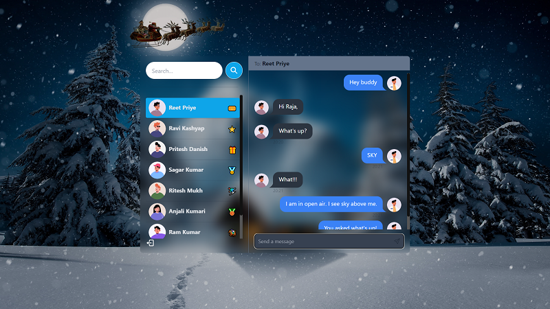

# Real-Time Chat Application - MERN Stack



Welcome to the Real-Time Chat Application! This project is built using the MERN stack, incorporating real-time communication with Socket.io, and styled with TailwindCSS and Daisy UI.

## Features

- 🌟 **Tech Stack**: MERN (MongoDB, Express, React, Node.js) + Socket.io + TailwindCSS + Daisy UI
- 🔐 **Authentication & Authorization**: Secured with JWT for managing user sessions.
- 💬 **Real-Time Messaging**: Instant chat functionality powered by Socket.io.
- 🚦 **Online User Status**: Display online users using Socket.io and React Context.
- 🌐 **Global State Management**: Managed with Zustand for a consistent app state.
- 🛠️ **Error Handling**: Comprehensive error handling implemented both on the server and client sides.
- 🚀 **Deployment**: Guidance for deploying the application professionally and for free!
- ⏳ **Additional Features**: More features and improvements included for a robust chat experience.

## Getting Started

### Prerequisites

Ensure you have the following installed on your system:

- Node.js
- MongoDB
- npm or yarn

### Installation

1.  **Clone the repository:**

    ```bash
    git clone https://github.com/reetpriye/convo-space.git
    cd convo-space
    ```

2.  **Install dependencies:**

    Needs to be done twice, in root folder and in frontend folder

    ```bash
    npm install
    cd frontend
    npm install
    ```

3.  **Setup Environment Variables**
    Create a .env file in the root directory and add the following variables:

    ```bash
    PORT=... [specify port you want to use]
    MONGO_DB_URI=... [create a cluster on mongoDB & use it's connection string]
    JWT_SECRET=... [any password]
    NODE_ENV=... [can be development or production]
    ```

4.  **Start the Backend**
    To start the backend server, execute:

    ```bash
    npm start
    ```

    The application should now be running on the port specified in your .env file or if you don't specify it will run on port 5000.

5.  **Start the Frontend**
    To start the frontend, execute:

    ```bash
    cd frontend
    npm run dev
    ```

    The application should now be visible on https://localhost:3000

## Usage

- Register or log in to access the chat functionality.
- Chat with other users in real time.
- View the online status of users.
- Log out to end the session securely.

## Deployment

Follow the steps to deploy your application on a free hosting platform like Heroku or Vercel. Ensure your environment variables are configured correctly on the hosting platform.

## Contributing

Contributions are welcome! Please fork the repository and submit a pull request with your improvements.

Happy coding! 🎉
